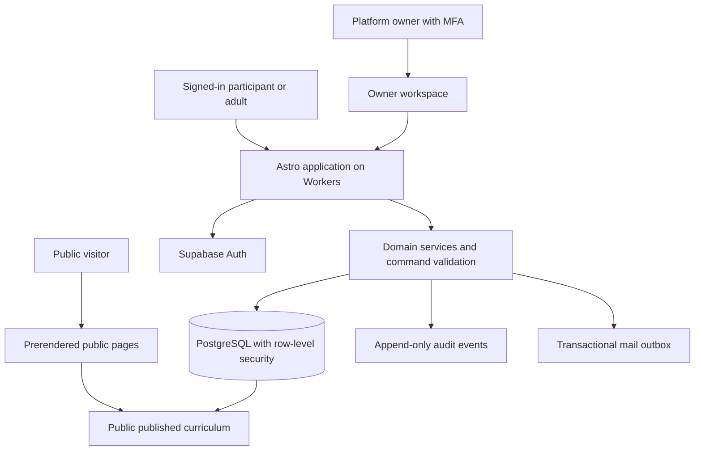

# Foundation Framework platform architecture and implementation plan

## Direction and scope

Evolve the current Astro prototype into a church-centered platform with four connected experiences: public discovery, participant and family workspaces, church operations, and a platform owner workspace. Preserve the workshop design, orange Cut FF identity, “Faithful in the everyday.” tagline, and 1 Corinthians 3:11 theme verse.

The first live release must support a complete, persistent loop: practice, request review, receive feedback, demonstrate, and obtain approval from an authorized adult. The [pilot specification](pilot-specification.md) defines that loop and remains the starting product specification. This plan adds technical choices, owner capabilities, deployment, and a build sequence. No services, paid accounts, or infrastructure are provisioned by this document.

Decided direction: church-scoped access; overlapping roles; immutable curriculum versions; readiness separate from approval; owner preview and audited support sessions; no payments required for participation. Proposed defaults: Supabase plus Cloudflare Workers, invitation-only membership, guardian-assisted access for teens without email, and a read-only first release of real-account support mode. Confirm these defaults before provisioning.

## Four connected experiences

| Experience             | Main routes proposed                                        | Responsibilities                                                                                              |
| ---------------------- | ----------------------------------------------------------- | ------------------------------------------------------------------------------------------------------------- |
| Public site            | Existing pages, challenges, role guides, downloads          | Explain the program, publish sample/shared curriculum, provide church and notebook materials                  |
| Participant and family | `/app/workshop/`, `/app/attempts/:id/`, `/app/family/`      | Practice progress, review requests, feedback, approved records; linked parents see their teens                |
| Church workspace       | `/app/church/`, members, relationships, curriculum, reviews | Invite members, connect adults to teens, designate reviewers, select reviewed curriculum, oversee completions |
| Platform owner         | `/owner/`, churches, catalog, previews, support, operations | Manage churches and shared content, diagnose problems, view costs and service health                          |

These are workspaces within one application, not four separate codebases. A person can switch among capabilities they actually hold. Selecting “mentor” or another perspective changes presentation; it never grants permission. A teen and a parent may both use the workshop, but the interface must identify whose progress is open and who is making changes.

The owner can create or suspend churches, bootstrap coordinators, manage global curriculum and platform configuration, preview every workspace, and begin scoped support sessions. Ordinary owner screens show operational metadata, not unrestricted teen practice records.

## Recommended stack

Retain Astro and TypeScript. Use prerendered public routes and server-rendered authenticated routes, with a same-origin server layer handling commands. Astro supports on-demand routes through adapters; its official Cloudflare adapter supports Workers deployment. Verify the installed Astro version and adapter together in a staging spike before restructuring production. [Astro rendering](https://docs.astro.build/en/guides/on-demand-rendering/) · [Cloudflare adapter](https://docs.astro.build/en/guides/integrations-guide/cloudflare/).

Use Supabase managed PostgreSQL and Auth. Relationships, reviewer scope, versioned attempts, transactions, and audit events fit a relational model. Supabase integrates Auth with row-level security; this is a good fit for the access boundaries proposed here. [Auth](https://supabase.com/docs/guides/auth) · [Row-level security](https://supabase.com/docs/guides/database/postgres/row-level-security).

Use Cloudflare Workers for Astro’s application runtime and static assets. Use GitHub Actions for validation and deployment. Keep infrastructure accounts owned by you, with documented recovery and secret rotation. Retain SQL migrations, seed fixtures, and deployment configuration in Git. Introduce a separate transactional email service through custom SMTP before live invitations; choose that provider during provisioning. Supabase’s default mail service has restrictions unsuitable for general production onboarding. [SMTP configuration](https://supabase.com/docs/guides/auth/auth-smtp).

| Alternative                                                                   | Decision                                                                                                                  |
| ----------------------------------------------------------------------------- | ------------------------------------------------------------------------------------------------------------------------- |
| Rewrite as a new frontend                                                     | Defer; no identified requirement justifies discarding the existing Astro pages                                            |
| Assemble a database, separate auth provider, and custom authorization service | Defer; adds integration work to the first release                                                                         |
| Self-host the database and authentication                                     | Defer; increases backup, upgrade, and operational responsibility                                                          |
| Keep GitHub Pages and add a browser-only database client                      | Keep Pages for the prototype, but prefer a server layer for owner support, invitation administration, and review commands |

No microservices, realtime subscription layer, upload pipeline, or message broker is needed for the pilot. Normal reads and explicit refresh after saves are enough. Add small client components only where the workshop or editor needs them.

## System boundaries

Public builds consume only approved public curriculum projections. They never contain private church records. Public catalog publishing triggers a validated build; church-private versions are fetched only within the authenticated application. Users do not need a new site build to save progress or obtain approval.

Private responses use `Cache-Control: private, no-store`; exclude them from shared caches and public search indexing. Login, application, and owner routes stay outside prerendering. Ordinary reads use the authenticated user context so database policies apply. Privileged provider keys are server-only and reserved for narrowly defined administrative operations.

## Identity and onboarding

Use invitation-based enrollment, not an open list of churches and members. Invitations are single-use, expire after seven days, carry the intended church and role, and store only a token hash. Acceptance revalidates the inviter’s current authority and the destination; role claims supplied by a browser are ignored.

Proposed initial sign-in: managed email/password with recovery for adults and teens who have their own eligible email account. Require MFA for the owner and church coordinators, with an application gate that checks assurance level before privileged actions. Supabase supports MFA; provider configuration and recovery handling are part of the auth milestone. [MFA documentation](https://supabase.com/docs/guides/auth/auth-mfa).

A teen without email gets a participant profile linked to an authenticated guardian. The guardian opens an explicitly labelled “Working with [teen]” workspace and can record practice and submit a review request with the teen. Every action retains the guardian as actor and the teen as participant. This is not an independent teen login or a hidden impersonation session. It revises the pilot’s original teen-only editing default for these profiles; normal parent accounts remain read-only for independently signed-in teens. Assisted mode never grants approval rights.

If independent no-email teen sign-in is required at launch, revisit the auth choice before building enrollment; do not invent synthetic email addresses, shared passwords, or permanent bearer links as substitutes. A guardian-managed profile can later link to a teen’s verified identity without replacing participant or attempt IDs. Confirm the age and guardian authorization process with the pilot church before live invitations.

Use the supported server-side session flow and validate identity on each private request; do not trust a client-provided role or unverified session object. Supabase documents cookie-based SSR and PKCE; pin and test the SSR helper version because its API is still described as beta. [SSR guidance](https://supabase.com/docs/guides/auth/server-side). Cookie settings, logout, CSRF/origin checks, session expiry, and shared-device behavior belong in the auth acceptance tests.

## Authorization and tenant isolation

Maintain separate platform grants, church role grants, participant relationships, and reviewer grants. The owner role is not a universal church membership. Church context is server-resolved and checked against current membership on every request.

Every tenant-owned record carries `church_id`. Composite foreign keys prevent relationships, attempts, grants, and review records from joining entities in different churches. Row-level security denies access by default. Use current membership and relationship rows rather than stale role claims embedded in long-lived tokens. Suspension and revocation therefore take effect on the next request.

| Actor               | Read scope                                      | Write scope                                                                            |
| ------------------- | ----------------------------------------------- | -------------------------------------------------------------------------------------- |
| Teen                | Own participant attempts and feedback           | Own active practice and review requests                                                |
| Guardian            | Linked participant progress and shared feedback | Assisted profile practice only when explicitly configured                              |
| Mentor              | Assigned participant attempts                   | Shared feedback only through an authorized review or defined coaching action           |
| Designated reviewer | Granted participant/challenge scope             | Review decisions within that scope                                                     |
| Coordinator         | Participants and operations in their church     | Memberships, relationships, grants, curriculum selection, reasoned approval revocation |
| Owner               | Global catalog and church operational metadata  | Platform management; private reads only through a scoped support session               |

Do not expose direct table writes for review decisions or completions. Use transactional database functions invoked with the real actor’s authenticated context. Functions recheck membership, reviewer scope, attempt version and state; any elevated execution uses a fixed search path and narrowly granted execution permission. Ordinary users cannot change approval state, reviewer grants, or audit rows through an alternate API.

## Owner preview and support sessions

**Preview as** uses a dedicated demo church with synthetic fixtures: teen, guardian, mentor, reviewer, coordinator, and curriculum states. It allows navigation through all perspectives and resets to known data. Demo commands cannot reference production participants. A prominent “Demo preview” banner remains visible. Provide this before real-account support access.

**Support session as** is a controlled view of a real account’s experience. The owner remains authenticated as themselves; do not obtain the target user’s password, mint their tokens, or replace the session identity. Store `actor_user_id`, `target_user_id`, `church_id`, purpose, allowed read capabilities, start/expiry time, and revocation state. Proposed duration: 15 minutes with explicit renewal and a new audit event.

The server computes what the target can see, intersects that with the session’s allowlist, and returns a limited projection through dedicated support-read functions. Every request checks owner grant, MFA, expiry, target membership, and scope. Support reads do not use an unrestricted owner wildcard in RLS. Record session start, accessed resource identifiers, renewal, and end without copying private note bodies into logs. If the audit event cannot be persisted, deny the support read.

Keep a persistent banner naming the target and church, show the expiry, and provide an Exit action. Record the session for the church coordinator to review. Disable downloads, bulk exports, invitations, role changes, approval/revocation, password changes, and content edits while viewing as another user. Distinguish an empty-state preview from an actual permissions problem.

Real-account support mode is read-only in its first release. Later corrections must be separate owner actions with reasons and before/after metadata, never changes attributed to the target. Approval always belongs to the actual authorized reviewer. You can inspect any of the four experiences through demo preview; participant-level production access requires this explicit support path.

## Core data and command contracts

Use the [pilot data model](pilot-specification.md#data-model), adding these records:

| Record                      | Required fields or rule                                                                                                  |
| --------------------------- | ------------------------------------------------------------------------------------------------------------------------ |
| Platform role grant         | User, capability, granted by, active status; bootstrap your owner grant through a migration, never a public signup claim |
| Invitation                  | Church, issuer, intended role/contact, token hash, expiry, accepted/revoked time                                         |
| Assisted participant access | Guardian membership, participant, active mode and authorization record                                                   |
| Support session             | Real actor, target, church, capabilities, purpose, expiry, revoked time                                                  |
| Curriculum publication      | Version, publisher, time, visibility, release status                                                                     |
| Platform setting            | Typed key/value, actor, change audit; secrets live in the hosting secret store                                           |
| Mail outbox                 | Event, recipient, template, deduplication key, delivery state; no sensitive practice content                             |
| Operational usage snapshot  | Period, source, approximate usage and cost, last updated time; initial owner entry can be manual                         |

UUID challenge IDs and stable checklist item IDs are independent of URL slugs and display order. Attempt versions pin requirements and review criteria. Publish creates an immutable version; corrections produce a new version. Church variations fork a version with source attribution. A coordinator can disable new starts without invalidating existing attempts or completions. Explicitly archive a withdrawn unsafe version with a documented treatment for active attempts.

| Command               | Required checks and result                                                                       |
| --------------------- | ------------------------------------------------------------------------------------------------ |
| Start attempt         | Enabled version, participant authority, unique active attempt                                    |
| Save practice         | Active state, expected revision, valid checklist IDs; increment revision                         |
| Submit review         | Checklist readiness, addressed feedback, current reviewer grant; snapshot and idempotent request |
| Withdraw request      | Authorized participant actor, still pending; preserve history and return to active               |
| Decide review         | Actual authorized reviewer, pending snapshot, row lock; approve once or request practice         |
| Revoke completion     | Coordinator authority and reason; preserve prior decision and recalculate totals                 |
| Import local practice | Previewed mapping and explicit selection; never create an approval                               |
| Publish curriculum    | Publisher authority, schema validation, immutable new version                                    |

Use revision checks and idempotency keys for writes. Race-safe uniqueness prevents two approved completions for the same attempt. A review decision and completion record commit together. Submitted practice is read-only until withdrawal or more-practice feedback; approved work stays locked. Completing Foundation 7 changes suggestions but does not automatically award Apprentice or unlock a later level.

## Application code structure

Keep one repository. Add `src/server/auth`, `authorization`, `curriculum`, `attempts`, `reviews`, `support`, and `audit` modules; `src/pages/app` and `src/pages/owner` contain thin route handlers and screens. Put migrations and deterministic seed fixtures in `supabase/`. Add policy/transaction tests and browser journeys in `tests/`.

The existing progress adapter becomes an asynchronous interface. Public sample mode can retain local storage; account mode uses server-backed progress. Separate APIs and labels for checklist progress and approved completions. Preserve the existing role guides as public orientation; do not expose technical infrastructure choices in participant flows.

## Deployment and migration

Create isolated local/test, staging, and production environments. Staging uses synthetic users only. Build previews must not carry production credentials. Validate pinned Astro/adapter/Auth SDK versions together before switching the production host. GitHub Actions runs type/content checks, policy/transaction tests, and key browser journeys before publishing artifacts.

Keep GitHub Pages live during implementation. After staging and the pilot readiness checks pass, publish the application to Workers under a domain you choose. Prefer public and private routes on one origin. If the GitHub Pages URL remains the public home initially, use a clearly labelled link to the application rather than cross-origin shared login assumptions.

Local storage does not travel to a new domain. Before migration, add an explicit export/import tool to the old prototype. Export challenge/item/version mapping and practice values only; preview the import in the authenticated workspace. Do not read old-origin browser data remotely or imply it has synced. Imported practice is unverified and never approved. Retain the old data until the participant confirms successful import.

Deploy backward-compatible database changes before dependent app code. Use additive migrations and a recorded backfill; do not make emergency code rollback depend on undoing destructive schema changes. Snapshot before migrations. Keep public curriculum builds independent of private progress availability. A maintenance/read-only mode can stop mutations while preserving records during incidents.

## Operations and cost ownership

The owner dashboard initially shows church counts, active participants, pending reviews, failed mail jobs, application errors, and manually entered provider costs. It does not need provider billing credentials in the app. Add automated usage imports later through restricted server-side integrations.

As checked October 9, 2026, Supabase Pro starts at $25/month for one included project, with daily backups retained for seven days; its free tier pauses inactive projects and does not include automatic backups. Cloudflare Workers Standard has a $5/month base subscription plus usage charges. Budget roughly $30/month in those base services for one small production database and application, before email, domain registration, staging compute, taxes, and overages. This is a planning estimate, not a spend authorization. [Supabase pricing](https://supabase.com/pricing) · [Workers pricing](https://developers.cloudflare.com/workers/platform/pricing/).

Use free/local resources for development where suitable; do not equate a free-tier experiment with the final production operating plan. Track quotas, preserve provider spend caps where available, configure runtime limits, and use alert thresholds at 50%, 80%, and 100% of an agreed budget. Cost recovery through donations or subscriptions can be considered later without making payment part of the pilot.

Use structured operational logs with correlation IDs; redact tokens, invitation links, email addresses, and practice-note bodies. Audit events store actor and subject IDs separately. Monitor login failures, save errors, review errors, policy denials, and email delivery failures. Rate-limit login, invitation, and support-session creation. Keep an incident procedure for suspending access, stopping writes, restoring data, and notifying the affected coordinator.

Proposed pilot recovery targets: at most 24 hours of lost writes and restoration within one business day. Configure backups to meet those targets and prove restoration in staging before enrollment. Define retention, church exit/export, participant unlinking, and deletion handling before storing live records; archived records must not silently remain available through old links or support sessions.

## Implementation milestones

These milestones are dependency-ordered. Deliver a working demonstration and its acceptance evidence at each stage; estimate effort after the compatibility spike rather than promise dates now.

| Milestone                          | Deliverable                                                                                                                        | Exit criteria                                                                                                       |
| ---------------------------------- | ---------------------------------------------------------------------------------------------------------------------------------- | ------------------------------------------------------------------------------------------------------------------- |
| 0 — Foundation and compatibility   | Stable content IDs, reviewed initial versions, domain modules, local Supabase fixtures, Astro/Workers SSR and Auth spike           | Current public pages still build; private route and cookie refresh work in staging; proposed defaults resolved      |
| 1 — Identity and church boundaries | Invitations, sign-in/recovery, MFA, church membership, parent/mentor links, reviewer grants, assisted profile mode                 | Direct cross-church access denied; revoked grants take effect; assisted actions retain real guardian attribution    |
| 2 — Persistent workshop            | Saved attempts and checklists, explicit save states, revision conflicts, approved-total separation, local import preview           | A second device sees the same progress; stale writes fail visibly; imports cannot award completion                  |
| 3 — Review and approval            | Review queue, snapshots, feedback, withdrawal, transactional approval/revocation, approved print records                           | End-to-end teen/reviewer loop works; concurrent and repeated commands produce one valid decision                    |
| 4 — Church and owner operations    | Coordinator tools, shared catalog publication, church setup, owner settings and operational metrics, demo Preview as               | You manage ordinary setup and shared content without source edits; demo actions cannot touch real participants      |
| 5 — Support and pilot readiness    | Scoped read-only support sessions, audits visible to coordinator, recovery drill, export/exit procedures, accessible/mobile review | Expired/revoked sessions deny reads; identity and banner stay explicit; support mode cannot mutate or export        |
| 6 — Church pilot                   | Reviewed seven-challenge starting set, small church group, four-week observation and issue fixes                                   | Participants and adults complete the loop without developer assistance; prioritized findings guide the next release |
| 7 — Expansion                      | Church-specific curriculum editor, additional churches and membership switching, broader curriculum and level policies             | Church changes create explicit versions; new features preserve tenant boundaries and earlier completions            |

For milestone 4, begin with a structured editor for shared drafts and publication. Milestone 7 adds church-owned forks and richer editing. Generated PDFs and brand assets remain checked-in downloads initially; making every printable dynamically editable is a separate feature. Mascots, storefronts, messaging, uploads, and monetization remain outside these milestones until they serve an observed need.

## Test and launch requirements

Use two churches and overlapping adult roles in test fixtures even while piloting with one church. Exercise direct backend calls as well as UI journeys: guessed IDs, revoked relationships, self-approval, attempted direct completion writes, stale versions, duplicate submissions, and concurrent reviews. Test ordinary owner requests separately from support capabilities.

Verify support expiry, revocation, target suspension, audit-write failure, cross-church scope, and prohibited mutation/export paths. Verify invitations cannot be replayed or escalated. Cover sign-in recovery, logout on shared devices, guardian-to-teen identity linking, keyboard use, mobile layouts, and both themes. Prove that no private response or token reaches a public build, shared cache, or operational log.

The pilot specification’s acceptance checks remain required. Before launch: approve the account/guardian process, select the first church and coordinator, review curriculum, authorize the provider budget and domain, configure transactional mail, complete a restore drill, and document retention and support-access expectations. These are provisioning and enrollment decisions, not reasons to postpone the local schema and compatibility work.

## First implementation task

Start milestone 0 in an isolated branch: introduce stable challenge/checklist IDs and a versioned seed catalog, define the asynchronous progress interface, and run a minimal Astro/Workers/Supabase session proof using synthetic data. Return the schema, policy tests, and staging demonstration for review. Keep the existing public site deployed until that foundation passes.
